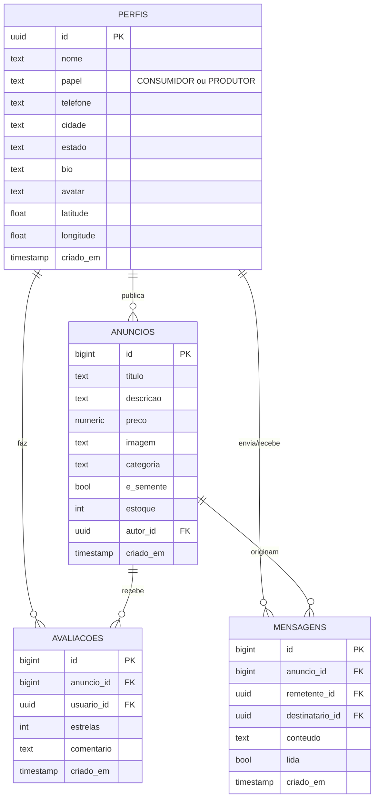

# Diagrama Entidade-Relacionamento — Mark Fruit

Estrutura do banco de dados PostgreSQL (Supabase). Os nomes apresentados
aqui estão **traduzidos para o português** para fins de documentação do
TCC; no banco real os nomes são em inglês (`profiles`, `posts`, `ratings`,
`messages`) por convenção técnica.

## Descrição das entidades

| Português (TCC) | Tabela real | Conteúdo |
|-----------------|-------------|----------|
| **Perfis** | `profiles` | Dados estendidos dos usuários (estende `auth.users`). |
| **Anúncios** | `posts` | Produtos publicados pelos produtores. |
| **Avaliações** | `ratings` | Notas de 1 a 5 com comentário (uma por usuário/anúncio). |
| **Mensagens** | `messages` | Conversas em tempo real consumidor ↔ produtor. |

## Relacionamentos

- Um **Perfil** publica vários **Anúncios** (1:N).
- Um **Anúncio** recebe várias **Avaliações** (1:N), e cada usuário só
  avalia uma vez (chave única composta `(anuncio_id, usuario_id)`).
- **Mensagens** ligam dois Perfis (remetente e destinatário) a respeito
  de um Anúncio.

## Como gerar a imagem para o TCC

Abra `docs/diagrama-banco.html` no navegador (basta dar duplo clique no
arquivo) — o diagrama é renderizado com fundo branco e tamanho ideal
para captura de tela.
